# To-Do List App

## Problem Statement

### Custom To-Do List with Local Storage
**Objective**: Build a dynamic to-do list app with CRUD functionality.  

**Requirements**:
1. Add tasks with a title and description.
2. Mark tasks as completed or delete them.
3. Save tasks in localStorage so they persist on reload.
4. Add drag-and-drop sorting for tasks.
5. Filter tasks by status (All, Completed, Pending).  

**Technology**: Angular v19

**Code quality expectations**:
1. Clean code
2. Comments
3. Naming conventions

## Assumptions
1. `Title` & `Description` both are mandatory fields while creating/editing a task
2. Bulk/Batch operations on items is out of scope for now

## Draft Designs
Looking at the requirements, I created some draft designs in Figma. 
They can be found [here](https://www.figma.com/design/ZbKwBr264voFI0vIrWXQTZ/To-Do-List?node-id=0-1&p=f&t=OHjCr1imouLZVV0K-0).
Please request access to the designs and I will provide it.  

**Note :** that the colors and items in the designs are just for building a quick draft and actual app has small variations as well as different color scheme.

Couple of screenshots of the designs are attached below : 

### Home Screen (Mobile)
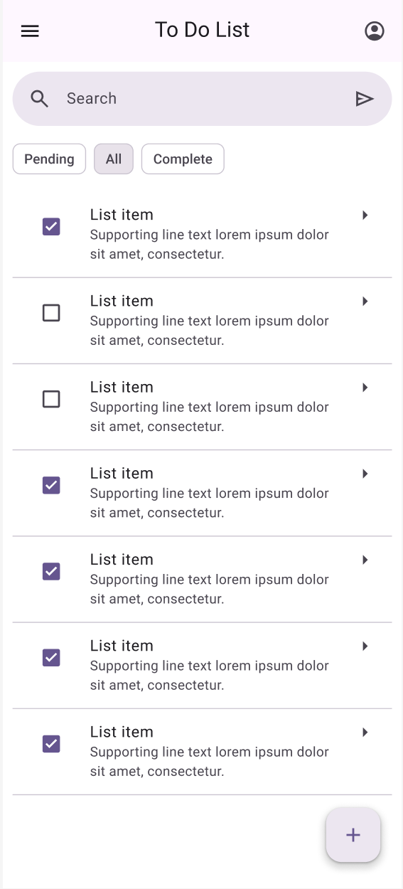  

### Home Screen - Task Dialog (Mobile)
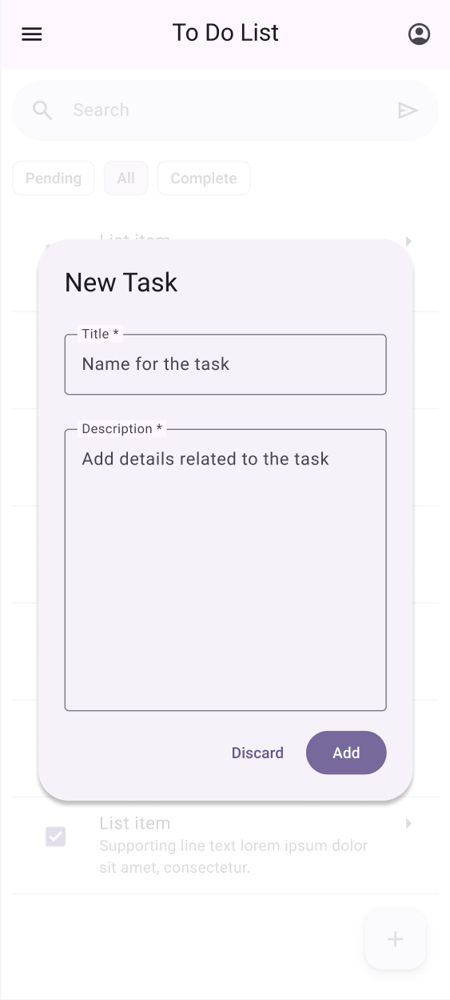  

### Home Screen (Web)
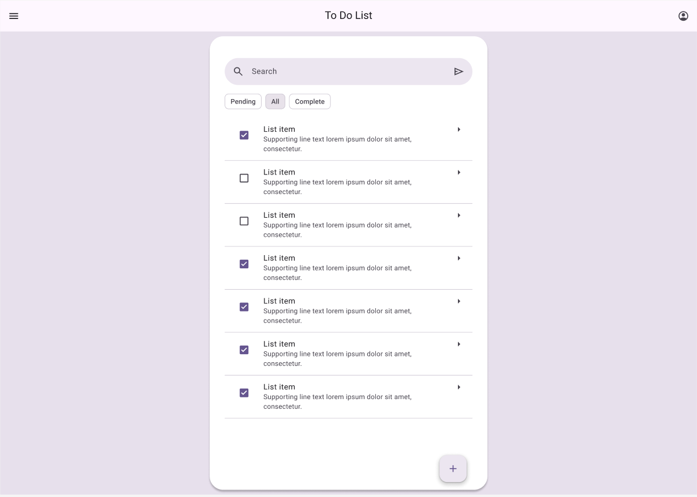  

### Home Screen - Task Dialog (Web)
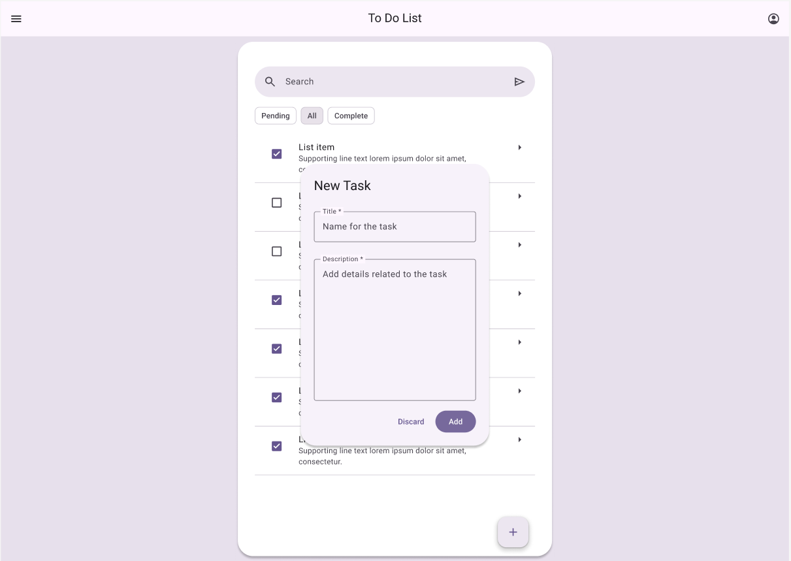  


## App Screenshots
Here are a couple of screenshots of the actual developed site :

### Home Screen - Pending Task List (Mobile)
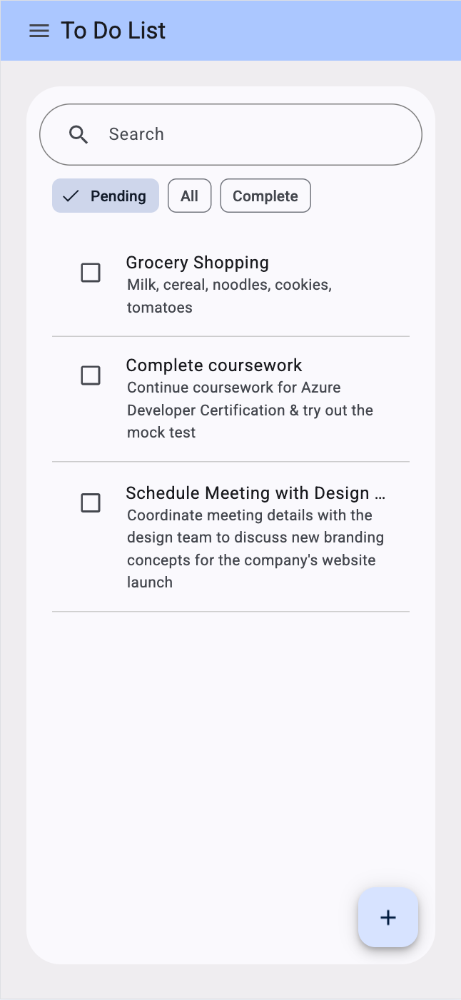  

### Home Screen - All Task List (Mobile)
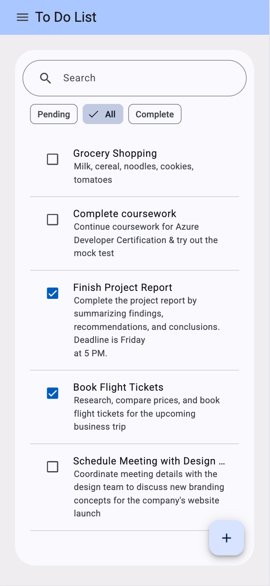  

### Home Screen - Completed Task List (Mobile)
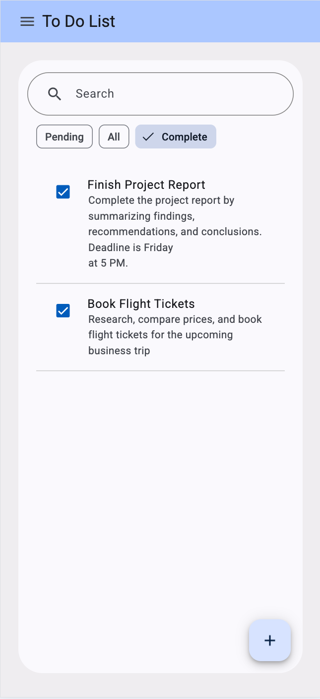  

### Home Screen - Search (Mobile)
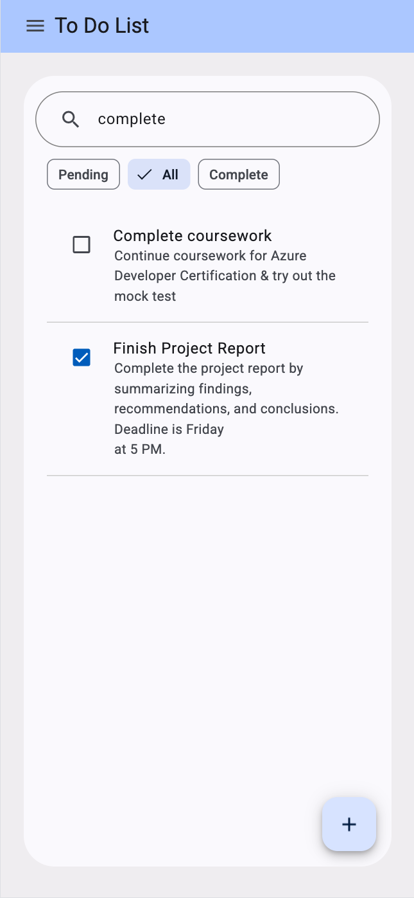  

### Home Screen - Create New Task Dialog (Mobile)
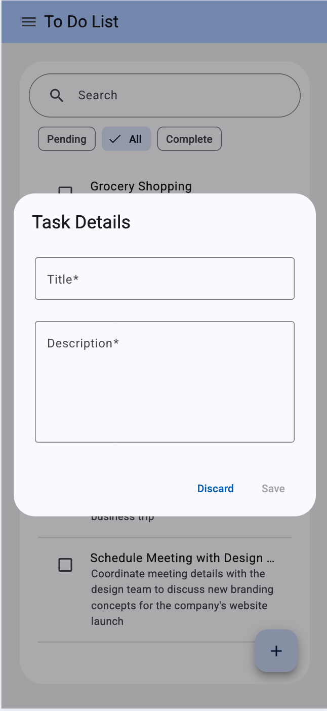  

### Home Screen - Edit Task Dialog (Mobile)
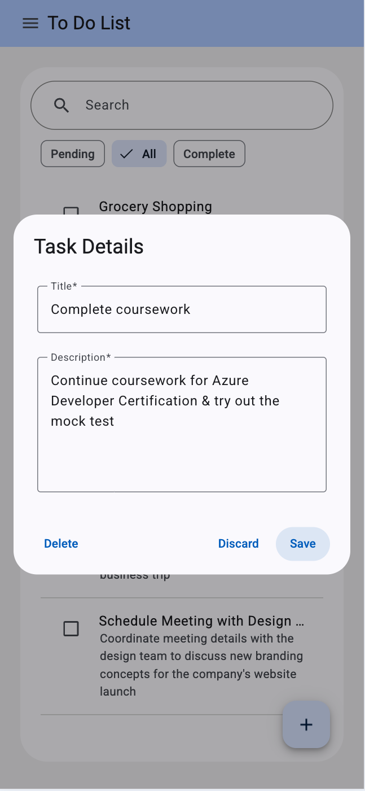  

### Home Screen - Pending Task List (Web)
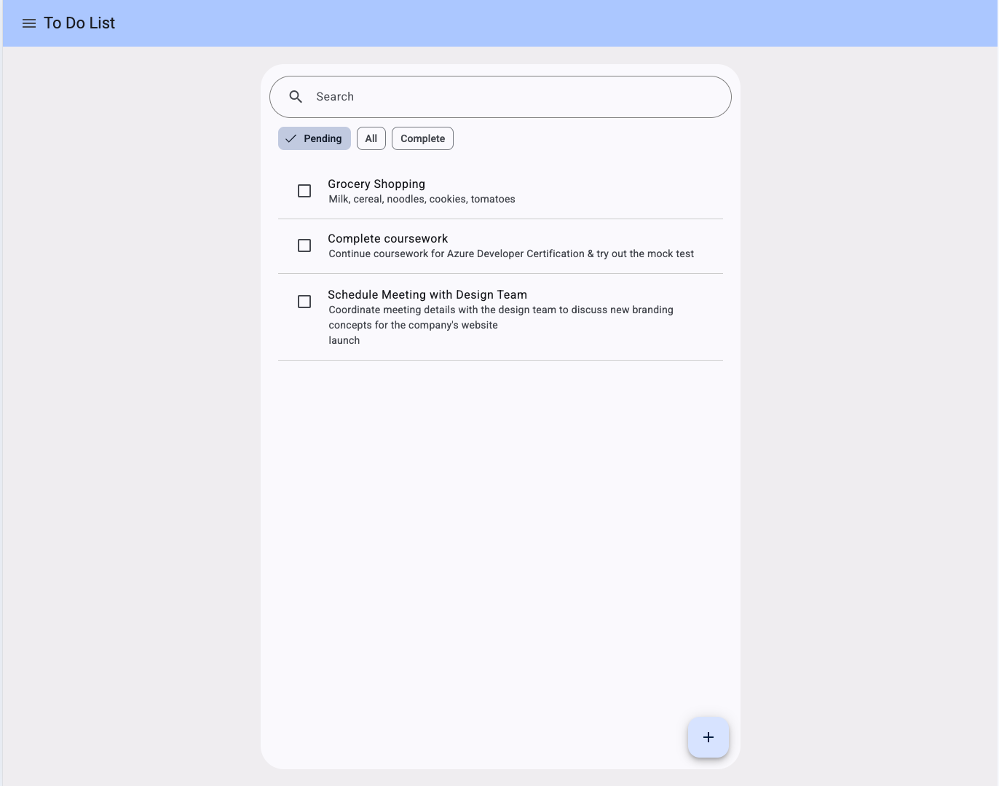  

### Home Screen - All Task List (Web)
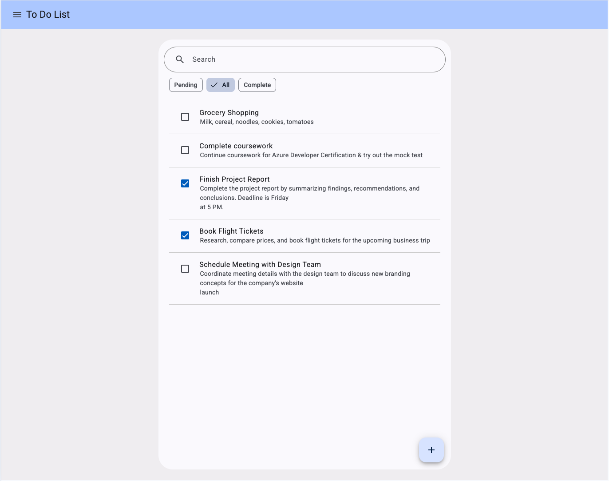  

### Home Screen - Completed Task List (Web)
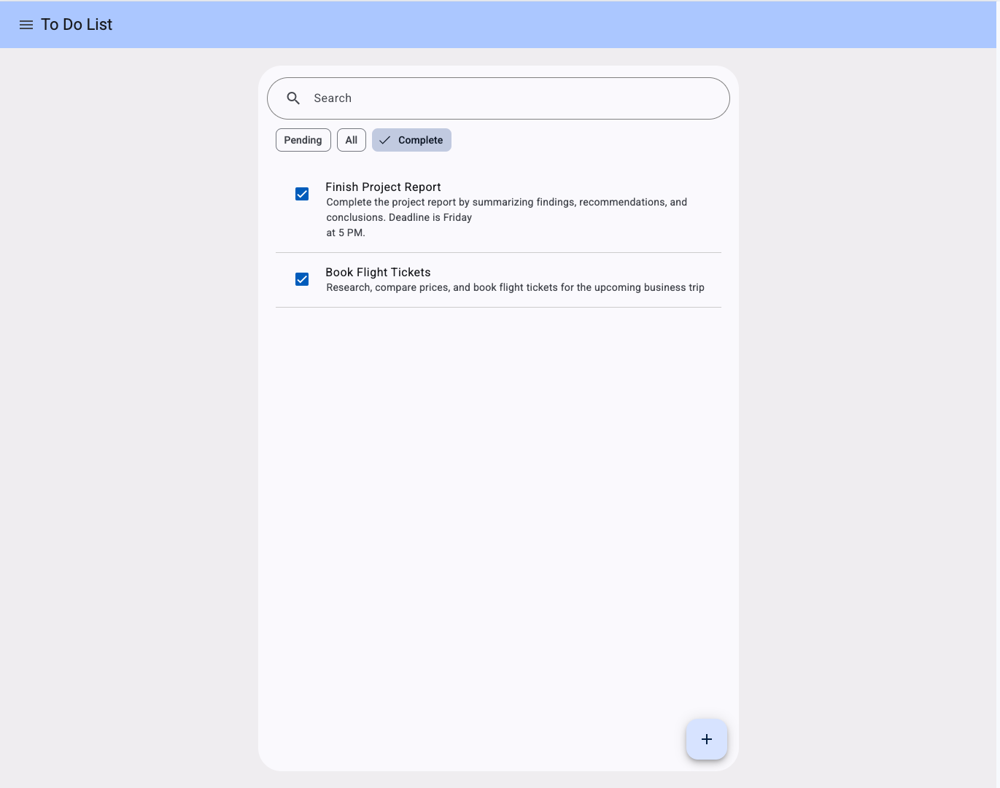  

### Home Screen - Search (Web)
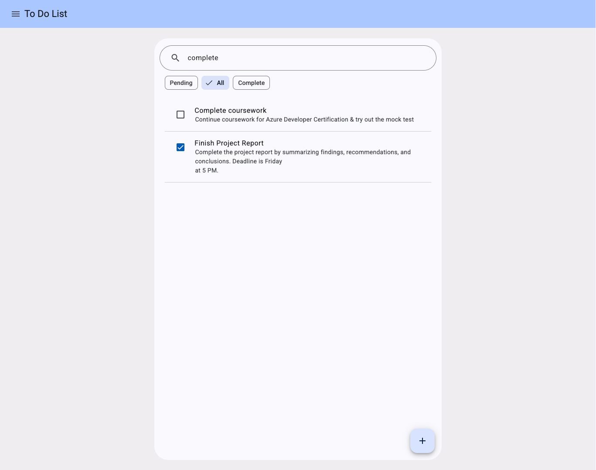  

### Home Screen - Create New Task Dialog (Web)
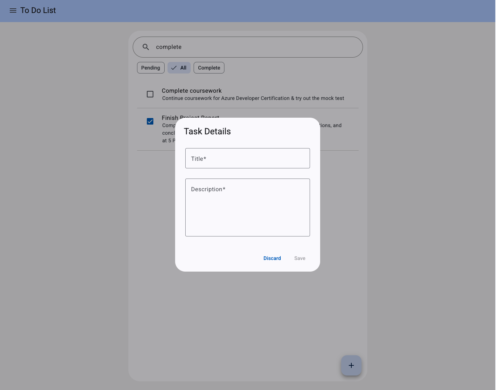  

### Home Screen - Edit Task Dialog (Web)
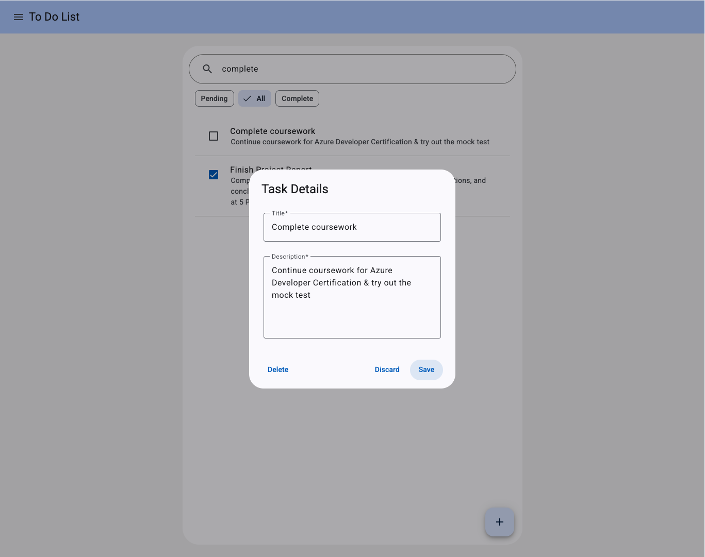  


## Features
1. **Create a task** - Click the FAB at the bottom of the list
2. **View a task** - Visible up-front
3. **Update a task** - Click on an item, edit details in the dialog
4. **Delete a task** - Click on an item, option to delete is available in the dialog
5. **Re-order tasks** - Click and hold an item, you can now drag it around to re-order
6. **Display updates** - Informative message after any add/update/delete operation is shown in a snackbar at the bottom of the list
7. **Persist tasks** - Tasks are saved in local storage for persistence across page reloads
8. **Filter tasks** - Chips available on the top of the list to view pending/all/completed tasks independently
9. `*Bonus*` **Search tasks** - A simple search by item filtering is implemented and can be used via search bar

## Next Steps
1. Check accessibility - annotations & content hierarchy
2. Write unit test cases
3. Create a Progressivbe Web App (PWA)

## Getting Started

### Option 1 - Running on Local Machine

1. Clone the repository. 

2. In the root filter, run the command below to install all the necessary packages
```
npm i
```
3. Once packages are installed, run either of the commands below to start the app  
```
npm run start
```
OR
```
ng serve
```

4. You should now be able to access the site on url mentioned in the terminal/command prompt. Default is :
```
localhost:4200
```

### Option 2 - Running on stackblitz
1. To view the source code, open [this](https://stackblitz.com/~/github.com/Rohan-Hirekerur/todo).
```
https://stackblitz.com/~/github.com/Rohan-Hirekerur/todo
```
2. Request access if not available
3. Access the app through the preview on the right panel or visit [here](https://todo-41g0--4200--1b4252dd.local-credentialless.webcontainer.io/).
```
https://todo-41g0--4200--1b4252dd.local-credentialless.webcontainer.io/
```